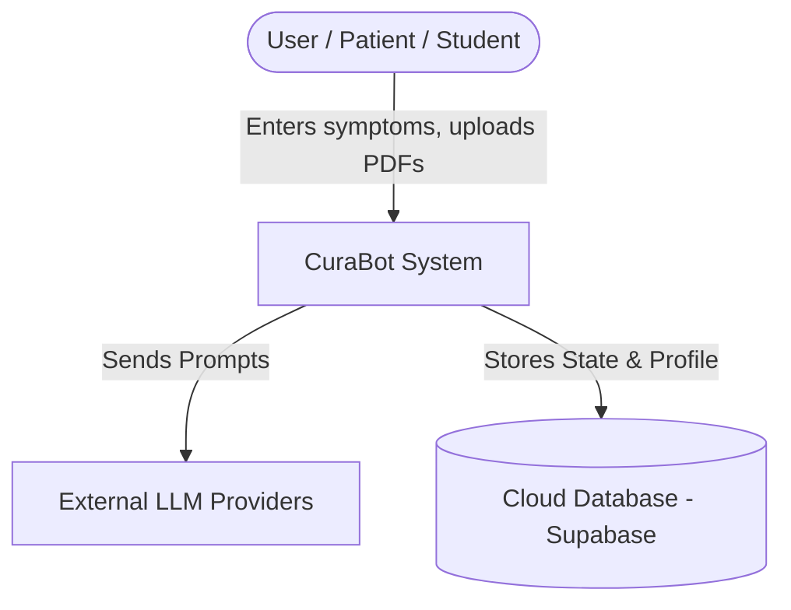
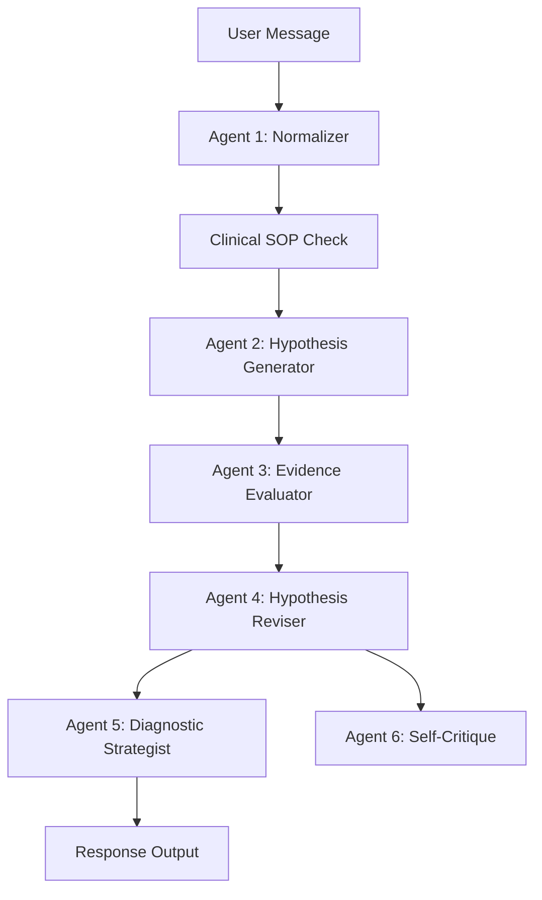

# CuraBot - Enterprise GenAI / Agentic AI Low Level Design (LLD)

## 1. Document Control & Metadata

**Purpose:** Make the LLD auditable, versioned, and approved with clear AI safety classification.

### Document Header
- **Project:** CuraBot
- **System Name:** Agentic AI Differential Diagnosis Tutor
- **Environment:** Local / Dev / Future Enterprise Sandbox
- **Confidentiality:** Internal / Project-Specific

### Versioning Table
| Version | Author | Reviewer | Date | Changes |
|---------|--------|----------|------|---------|
| v0.1 | Architecture Team | Product | 2026-05-02 | Initial draft using Enterprise GenAI Template |

### Approval Matrix
| Area | Reviewer | Approver | Evidence/Link |
|------|----------|----------|---------------|
| Architecture | Lead Architect | ARB | ADR list |
| Security | Security Lead | CISO Delegate | Threat Model (TBD) |
| Compliance | Compliance SME | Compliance Board | Medical Disclaimer Verified |

### AI Safety Classification & Data Handling Summary
- **Classification:** Educational / Non-Regulated for Medical Practice. (Disclaimer: FOR MEDICAL EDUCATION ONLY — Not for clinical use).
- **Data Sensitivity:** Handles potential synthetic PHI/PII (patient profile, medical history, lab reports). Data must be encrypted in transit and at rest.

### AI Autonomy Level
- **Level:** L2 (Supervised Assistant / Recommend-only).
- **Behavior:** The system provides diagnostic suggestions and reasoning but never takes clinical action, prescribes, or operates autonomously without user input.

### Reference Links
- BRD, HLD, ADRs: [Refer to Confluence / Internal Wiki]

---

## 2. System Overview

**Purpose:** Set clear scope boundaries so GenAI/agents do not “accidentally” expand behavior.

### Business Context & Stakeholders
- **Primary Personas:** Medical Students, Early-Career Healthcare Learners, General Users (Patients seeking preliminary insights).
- **Consuming Teams:** Educational administrators evaluating clinical reasoning logic.

### Problem Statement
Medical students lack structured, interactive tools to practice differential diagnosis outside classrooms. Patients struggle to interpret their symptoms before consulting doctors.

### Scope Table
| In-Scope | Out-of-Scope |
|----------|--------------|
| Conversational symptom intake and normalization | Real clinical use or certified medical diagnosis |
| 6-agent diagnostic pipeline (Normalizer, Hypothesis Gen, etc.) | EMR system integration (e.g., Epic/Cerner) |
| RAG-based retrieval from uploaded PDFs | Real-time IoT / wearable telemetry |
| Clinical SOP safety guardrails (Triage, FAST Stroke) | Prescription generation or medication ordering |
| Evidence evaluation and bias detection | HIPAA certification in current dev environment |

### Success Metrics and KPIs
- **Quality:** >80% Top-3 diagnostic accuracy against benchmark synthetic cases.
- **Performance:** System response time <3-4 seconds per interaction step.
- **Safety:** 100% adherence to SOP-008 (Stroke) and SOP-006 (Triage) triggering emergency overrides.

### Assumptions and Constraints
- LLM API rate limits may apply (handled via Gemini -> Groq -> OpenRouter fallback).
- User uploads readable PDF formats.

---

## 3. Architecture Decomposition

**Purpose:** Provide a layered breakdown (C4) plus deployment topology for enterprise runtime.

### C4 Diagram Placeholders

> **[Diagram Placeholder: C4-Context Diagram]**
> *Description:* Shows the User interacting with the CuraBot System, which in turn talks to External LLMs (Gemini, Groq) and the Cloud Database (Supabase).
> *Reference Tool:* Draw.io, PlantUML, Mermaid (see Appendix for Mermaid script).

> **[Diagram Placeholder: C4-Container Diagram]**
> *Description:* Details the Frontend App (React/Vite), Backend API (FastAPI), Local Vector DB (ChromaDB), and Relational DB (Supabase/SQLite).

> **[Diagram Placeholder: C4-Component Diagram]**
> *Description:* Zooms into the Backend API showing the LangGraph Orchestrator, 6 Agents, LLM Client module, and SOP pure-Python rule engine.

### Deployment Topology
- **Current Dev Setup:** Local Uvicorn server, local ChromaDB, local SQLite / remote Supabase (via Docker Compose).
- **MVP / Simple Project Deployment (Highly Reliable):** 
  - **Frontend:** Hosted on **Vercel** or **Netlify** (excellent, highly reliable global CDNs for React/Vite applications).
  - **Backend:** Hosted on **Render**, **Railway**, or **Heroku** for simple, reliable FastAPI deployment without the overhead of enterprise infrastructure.
- **Enterprise Target:** K8s cluster deployment, Frontend hosted on CDN/Nginx, Backend on scalable pod replicas.
- **Environment Separation:** Dev/Int/UAT/Prod configured via `.env` files (e.g., API keys, DB URIs).

---

## 4. GenAI Capability Design

**Purpose:** Design RAG/Graph-RAG/hybrid pipelines, prompt lifecycle, and hallucination controls.

### Retrieval Approach
- **Type:** Vector-RAG.
- **Mechanism:** Uploaded PDFs are parsed via `pdfplumber`, chunked (~600 chars), embedded via Google Generative AI embeddings (or dummy fallback), and stored in ChromaDB (`patient_records` collection).

### Document/Query Scoping Rules
- **Access Control:** All vector searches are strictly scoped by `user_id` using ChromaDB metadata filtering to prevent cross-tenant data leakage.

### Prompt Lifecycle
- **System Prompts:** Define strict agent identities (e.g., Symptom Normalizer, Diagnostic Strategist). Includes static rules like OPQRST guidelines.
- **Task Prompts:** Template-based prompts dynamically filled with session state, normalized symptoms, RAG context, and hypotheses.

### Guardrails & Hallucination Controls
- **Schema Validation:** Agents strictly output JSON. Output is parsed and validated before advancing in the pipeline.
- **Grounding Policy:** The Evidence Evaluator maps every piece of evidence to hypotheses. Medical Evidence Citation Engine cites actual medical guidelines and ICD-10 codes.
- **Rule-Based Fallbacks:** Critical safety logic (SOPs) and quantitative evaluations (Bayesian updates in Agent 4) are pure Python to prevent LLM hallucinations.

---

## 5. Agentic Design

**Purpose:** Specify agent inventory, roles/skills, orchestration graph, and HITL checkpoints.

### Agent Inventory
| Agent | Type | Inputs | Outputs | Tools/Fallbacks | Cannot Do |
|-------|------|--------|---------|-----------------|-----------|
| 1. Normalizer | Extraction | Raw message | Normalized symptoms | Keyword Fallback | Form hypotheses |
| 2. Hypothesis Gen | Diagnostic | Symptoms, KB | Ranked Hypotheses | Rule-based Score | Make final conclusions |
| 3. Evidence Evaluator | Analytical | Hypotheses, Evidence| Evidence Ledger | Full Rule-based | Skip negative evidence |
| 4. Hypothesis Reviser | Probabilistic| Ledger, Hypotheses | Revised Scores | Bayesian Fallback | Ignore severity floors |
| 5. Diagnostic Strategist| Control | Hypotheses, State | Next Q / Conclusion | Fallback to rules | Ignore missing red flags |
| 6. Self-Critique | Governance | Hypotheses, State | Bias Flags | Full Rule-based | Edit hypotheses directly|

### Orchestration Graph

> **[Diagram Placeholder: Orchestration Graph (LangGraph/DAG)]**
> *Description:* Shows the sequential flow: Initial state -> Agent 1 -> SOPs -> Agent 2 -> Agent 3 -> Agent 4 -> Agent 5 & 6 (parallel) -> Output.

### Human-in-the-Loop (HITL) Checkpoints
- **Review:** Users must provide inputs for each turn.
- **Approval UI:** The final diagnostic report is presented as "Recommend-Only"; users must consult real doctors.

---

## 6. Data & Knowledge Fabric

**Purpose:** Define sources, ingestion, sharding, caching, and memory/knowledge strategy.

### Data Source Catalog
- `diseases.json`: Curated Knowledge Base containing 100+ medical conditions, symptoms, severities.
- `Supabase`: Profiles, chat sessions, longitudinal history.
- `Medical Reports (PDF)`: User-uploaded patient records.

### Ingestion Pipeline
- **Extract & Normalize:** Text from PDFs using `pdfplumber`.
- **Chunk & Embed:** 600-character chunks embedded using Google models.
- **Index:** ChromaDB indexed with user/report metadata.

### Sharding & Caching
- **Sharding Strategy:** Vector DB scoped strictly per `user_id`.
- **Session State:** Conversational state persisted per session in Supabase/SQLite.

### Memory/Knowledge Strategy
- **Longitudinal Tracking:** Patient History Analyzer parses past conditions and severities for returning users to inform recurring issues.

---

## 7. API & Service Design

**Purpose:** Specify API inventory, contracts, versioning, and error handling.

### Services
- **Backend API (FastAPI):** Exposes all endpoints.

### API Inventory
| Service | Endpoint | Method | Purpose | Category |
|---------|----------|--------|---------|----------|
| Auth | `/api/auth/*` | POST/GET | User registration, login, profile fetch | Must-have |
| Chat | `/api/chat` | POST | Process message through 6-agent pipeline | Must-have |
| Documents | `/api/upload-record`| POST | PDF upload & RAG ingestion | Must-have |
| Reports | `/api/report/*` | GET | Generate JSON/HTML diagnosis output | Good-to-have |

### Error Handling & Resilience
- **Multi-Provider Fallback:** LLM calls cascade from Gemini -> Groq -> OpenRouter automatically upon rate limit or failure.
- **Rule-Based Fallbacks:** If all LLMs fail, agents gracefully downgrade to deterministic, rule-based operations.

---

## 8. Security & Governance

**Purpose:** Define LLM gateway, policy enforcement, approvals, audit trails, and FinOps.

### LLM Gateway & IAM
- **LLM Client Module:** Centralizes all outbound API calls (`services/llm_client.py`). Implements concurrency locks (`_api_lock`) and pacing to avoid rate limiting.
- **RBAC:** Simple user isolation. Future integration with OAuth/SAML.

### Data Protection
- Database fields containing PII (profiles) should be encrypted.
- Remote connections utilize HTTPS/WSS.
- No medical records are used for LLM training (API data privacy clauses must be verified).

### Audit Trails
- User logs are exported to `user_logs.xlsx` and database tracking conversation states, agent thought processes, and decisions.

---

## 9. Non-Functional Design

**Purpose:** Specify measurable NFRs and how architecture meets them.

### Performance SLOs
- Chat response latency < 4-5 seconds (dependent on LLM API speeds).
- Zero-latency SOP processing (pure Python execution).

### Reliability & Scalability
- Stateless FastAPI architecture allows horizontal scaling.
- LLM Provider cascading guarantees high availability even if primary provider fails.

### Security & Compliance NFRs
- strict educational disclaimer displayed prominently.
- Tenant isolation enforced dynamically at the database and vector search layer.

---

## 10. Observability & Evaluation

**Purpose:** Make GenAI observable and continuously measurable.

### Telemetry & Traces
- Agent "thoughts" are streamed or captured to provide transparent explainability.
- Logs capture every prompt output, fallback activation, and JSON parsing error.

### RAG Evaluation
- Evaluated via golden datasets (`evaluate_rag.py`) to measure Retrieval Recall and Precision on synthetic PDFs.

### Monitoring & Alerting
- Track API usage, latency per LLM provider, and frequency of SOP-006/SOP-008 emergency overrides.

---

## 11. SDLC Integration

**Purpose:** Integrate spec-driven dev, CI/CD, and AI agents into the engineering lifecycle.

### Testing & Quality Gates
- Extensive pytest suite running offline evaluations (e.g., `diagnose_failures.py`, `test_all_sops.py`).
- Golden test cases measure Top-3 accuracy against >100 predefined symptom configurations.

### CI/CD Stages
- Linting -> Unit tests -> Security Scans -> Build -> Deploy.

### Release Governance
- Kill-switch available via local rule-based fallback configuration if remote models deprecate or behavior drifts.

---

## 12. Risks & Failure Modes

**Purpose:** Enumerate AI-specific and system risks with concrete mitigations.

### Risk Register
| Risk | Mitigation | Residual Risk |
|------|------------|---------------|
| LLM Hallucination | Agent 3 (Evidence Evaluator) maps evidence; Citation Engine checks ICD-10. | Low |
| LLM Rate Limit | Multi-provider fallback chain (Gemini/Groq/OpenRouter). | Low |
| Parsing Failure | Fallback regex and JSON fixing techniques; Rule-based pipeline fallback. | Medium |
| Premature Diagnosis | SOP-015 forces minimum confidence levels, iterations, and evidence. | Low |
| Missing Red Flags | Pure Python Red Flag Scanner (SOP-013) forces emergency routing. | Low |

### Fallback Mechanisms
- Complete local execution capability using rule-based algorithms for Agents 3, 4, 6 and keyword heuristics for Agents 1, 2 if all cloud APIs are disconnected.

---

## 13. Appendix

**Purpose:** Provide reusable assets, diagrams, and references.

### How to Create the Diagrams (References)
You can use **Mermaid** markdown to generate the required architectural flowcharts easily. Place these blocks in markdown viewers that support Mermaid (like GitHub, Notion, or VS Code preview).

**C4 Context Diagram Reference (Mermaid):**


**Orchestration Graph Reference (Mermaid):**


### Sample Prompt & JSON Spec
- **Agent 2 Output Schema:**
```json
{
  "hypotheses": [
    {
      "name": "string",
      "confidence": "integer",
      "reasoning": "string",
      "severity_class": "critical|serious|moderate|benign",
      "key_features_present": ["string"]
    }
  ]
}
```
